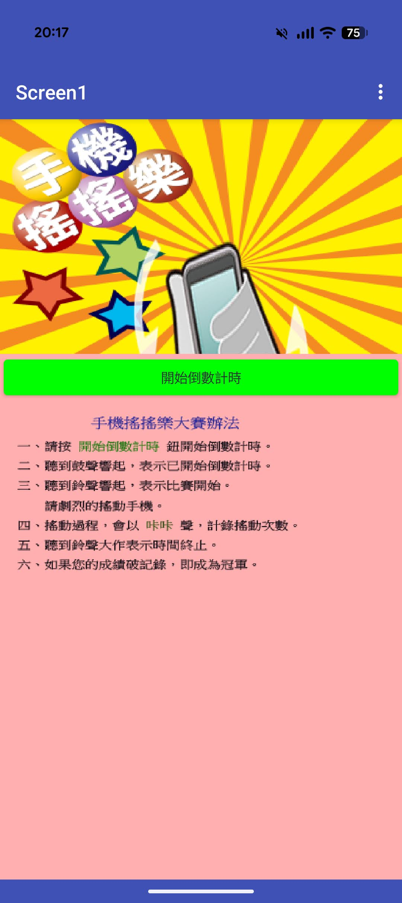
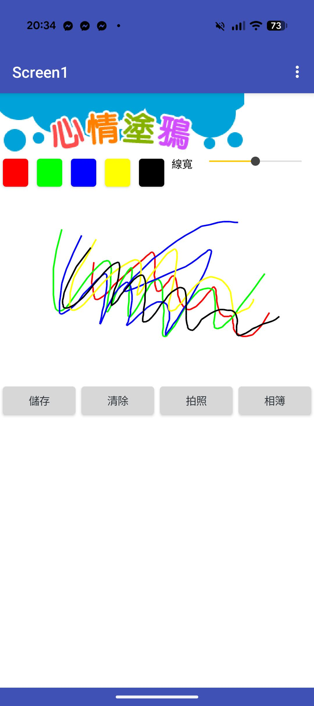
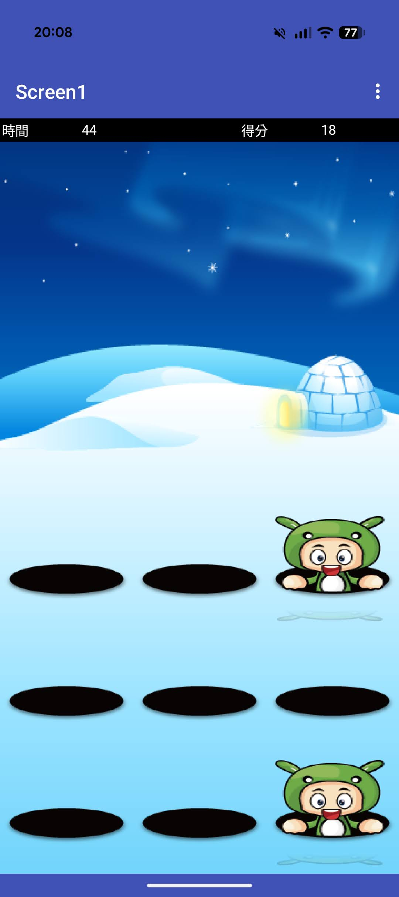
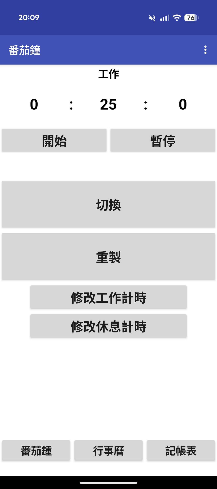
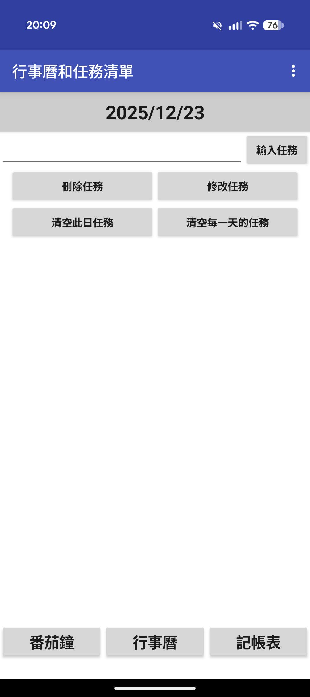
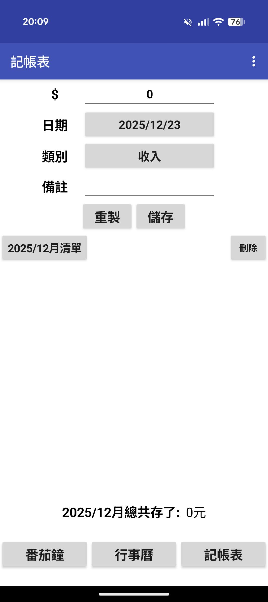

# App Inventor 專案集

這個儲存庫包含使用 [MIT App Inventor](https://appinventor.mit.edu/) 開發的 Android 應用程式專案。

---

## 📁 專案目錄

### a250220 - BMI計算應用

| IDE 設計畫面 | 程式區塊 |
|:---:|:---:|
|  |  |

**功能說明**：
計算BMI

---

### a250313 - 輸入密碼應用

| IDE 設計畫面 |
|:---:|
|  |

**功能說明**：
輸入密碼

---

### a250327 - 猜數字遊戲

| App 執行畫面 |
|:---:|
|  |

**功能說明**：
猜數字遊戲

---

### a250424 - 乒乓球遊戲
乒乓球遊戲

| App 執行影片 |
|:---:|
| [🎬 觀看示範影片](a250424/screen-20251223-201256-1766491968725.mp4) |

**功能說明**：
乒乓球遊戲

---

### a250506 - 指北針應用
指北針應用

| App 設計畫面 |
|:---:|
|  |

**功能說明**：
指北針應用

---

### a250508 - 手機搖搖樂
手機搖搖樂應用。

| App 執行畫面 |
|:---:|
|  |

**功能說明**：
手機搖搖樂應用

---

### a250515 - 心情塗鴉板    
心情塗鴉板應用。

| App 執行畫面 |
|:---:|
|  |

**功能說明**：
心情塗鴉板應用

---

### a250522 - QRcode產生器
QRcode產生器應用。

| App 執行畫面 |
|:---:|
|  |

**功能說明**：
QRcode產生器應用

---

### a250529 - 打地鼠遊戲
打地鼠遊戲應用。

| App 執行畫面 |
|:---:|
|  |

**功能說明**：
打地鼠遊戲應用

---

### report5 - 番茄鐘、行事曆、記帳表
番茄鐘、行事曆、記帳表應用。

| 番茄鐘 | 行事曆 | 記帳表 |
|:---:|:---:|:---:|
|  |  |  |

**功能說明**：
- 番茄鐘應用
- 行事曆應用
- 記帳表應用

---

## 🛠️ 開發工具

- **平台**: [MIT App Inventor](https://appinventor.mit.edu/)
- **類型**: Android 應用程式開發
- **檔案格式**: `.aia` (App Inventor 專案檔)

## 📖 如何使用

1. 前往 [MIT App Inventor](https://appinventor.mit.edu/) 並登入
2. 點選 **Projects** → **Import project (.aia) from my computer**
3. 選擇想要開啟的 `.aia` 檔案
4. 使用 **Connect** 連接手機或模擬器進行測試

## 📱 測試方式

- **實體手機**: 安裝 MIT AI2 Companion App
- **模擬器**: 使用 aiStarter 連接電腦版模擬器

---

Made with ❤️ using MIT App Inventor
